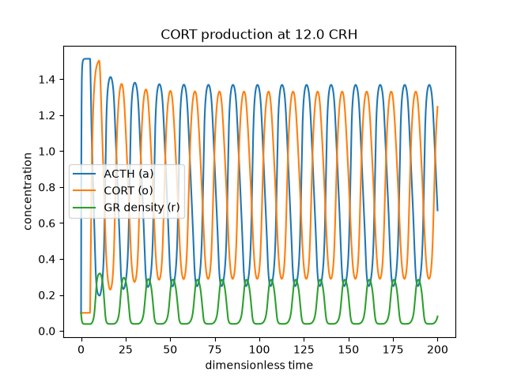
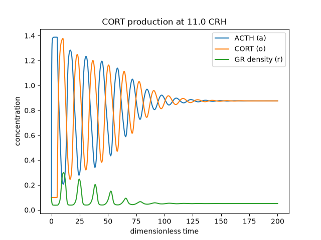

## Overview

The HPA axis regulates the stress response through a feedback loop between three
hormones (CRH, ACTH, CORT). This model demonstrates the self-sustained oscillations
(hourly cortisol pulses) via a **Hopf bifurcation** driven by the CRH input.

## Model Equations

The system is a set of delay differential equations (DDEs):
da/dt = CRH / (1 + p_2 * r * o) - p_3 * a
dr/dt = (o * r) ** 2 / (p_4 + (o * r) ** 2) + p_5 - p_6 * r
do/dt = a(t - tau) - o

## Dynamics & Bifurcation

CRH is the control parameter. Below a critical value the system settles to a
stable steady state; above it, sustained oscillations emerge (Hopf bifurcation).

- With these parameters, **CRH ≈ 12.0** is required to sustain oscillations.
- The high threshold is a consequence of the fast ACTH degradation (`p_3 = 7.5`),
  which requires a large CRH input to maintain the loop.

During each pulse, the phase-lagged cascade produces GR density rising and CORT rising while ACTH falls,
which is the shutdown half of the feedback cycle, with ACTH and GR in approximate **anti-phase**.

## Implementation Notes

- The delay is implemented with a history buffer: `a_hist[i − delay_steps]`,
  where `delay_steps = round(tau / dt)`.
- For `i < delay_steps`, the delayed value falls back to `A_0`.
- State is recorded at the top of the integration loop so `a_hist[i]` aligns
  exactly with time `i * dt`.
- State and history are reset at the start of each CRH stage for fair comparison
  across parameter sweeps.

## Usage

```bash
python model.py
```

## Requirements
numpy=2.4.4
matplotlib=3.11.1

## Results
Sustained oscillation at **CRH = 12.0**: 


A beautiful cone-shaped semi-oscillation at **CRH == 11.0**:


## References
Walker JJ, Terry JR, Lightman SL (2010). Origin of ultradian pulsatility in
the hypothalamic–pituitary–adrenal axis. Proc. R. Soc. B. https://doi.org/10.1098/rspb.2009.2148
Rankin J, Walker JJ, Windle R, Lightman SL, Terry JR (2012). Characterizing
dynamic interactions between ultradian glucocorticoid rhythmicity and acute
stress using the phase response curve.
